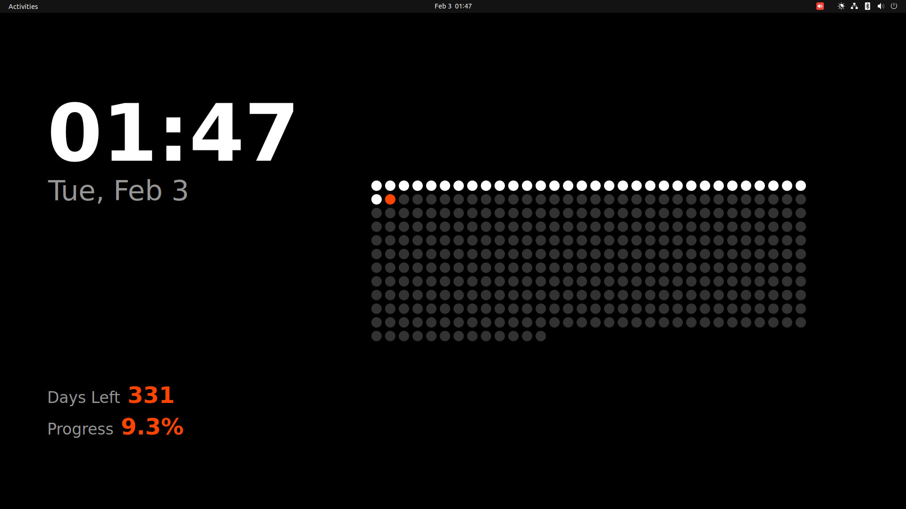
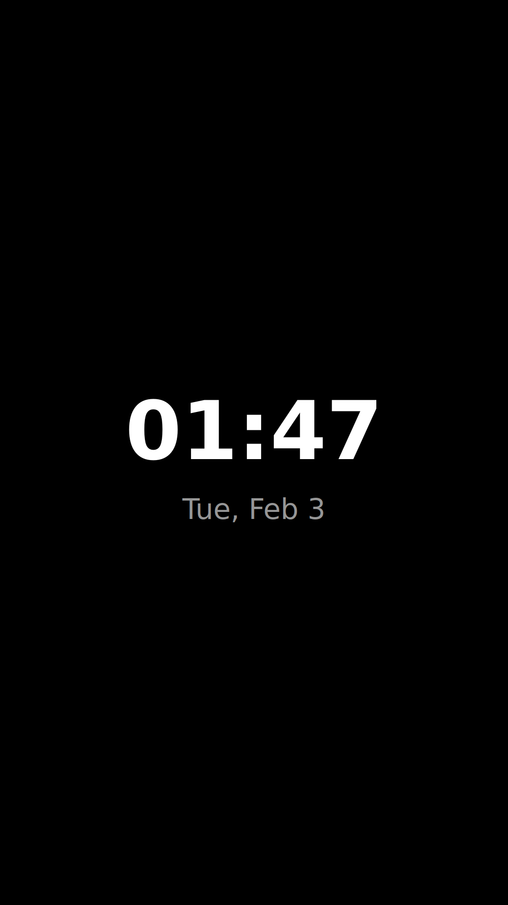

# Life Calendar Wallpaper

A minimalist, interactive desktop wallpaper that visualizes the progress of the year.
It uses a native Python script to render directly to your desktop, supporting multi-monitor setups with adaptive layouts.

## Screenshot Examples
### Landscape (Horizontal)


### Portrait (Vertical)


## Features
- **Native Rendering**: Uses PyQt5 (no browser needed) for high performance and low resource usage.
- **Multi-Monitor Support**: Automatically detects all connected screens.
- **Adaptive Layouts**:
  - **Landscape**: Horizontal dashboard with side-by-side stats and grid.
  - **Portrait**: Minimalist vertical layout (Clock & Date only).
- **Aesthetic**: Dark mode with "Inter" font and Red-Orange accents.

## Installation

1.  **Install Dependencies**:
    ```bash
    pip install PyQt5
    ```
    *(Note: You do not need Hidamari anymore)*

2.  **Run**:
    ```bash
    python3 wallpaper_runner.py
    ```

## Autostart on Login

To make it start automatically when you log in, create a desktop entry:

1.  **Create the file**:
    ```bash
    mkdir -p ~/.config/autostart
    nano ~/.config/autostart/life_calendar.desktop
    ```

2.  **Paste the following** (Update the `Path` and `Exec` to match your actual directory):
    ```ini
    [Desktop Entry]
    Type=Application
    Name=Life Calendar Wallpaper
    Exec=/usr/bin/python3 /path/to/your/folder/wallpaper_runner.py
    Path=/path/to/your/folder
    X-GNOME-Autostart-enabled=true
    Terminal=false
    ```

## Customization
You can modify `wallpaper_runner.py` to adjust colors, fonts, or layout logic.

## Credits
Based on the "Life Calendar" concept.
